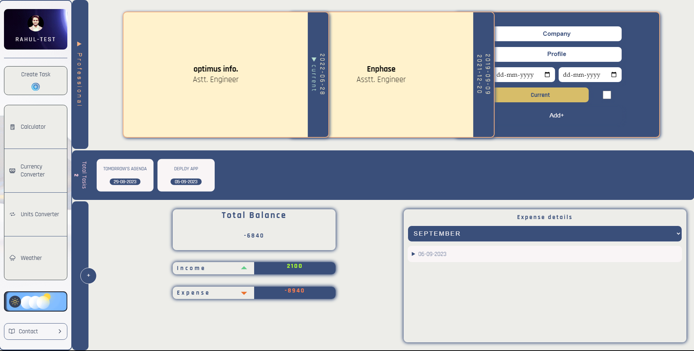
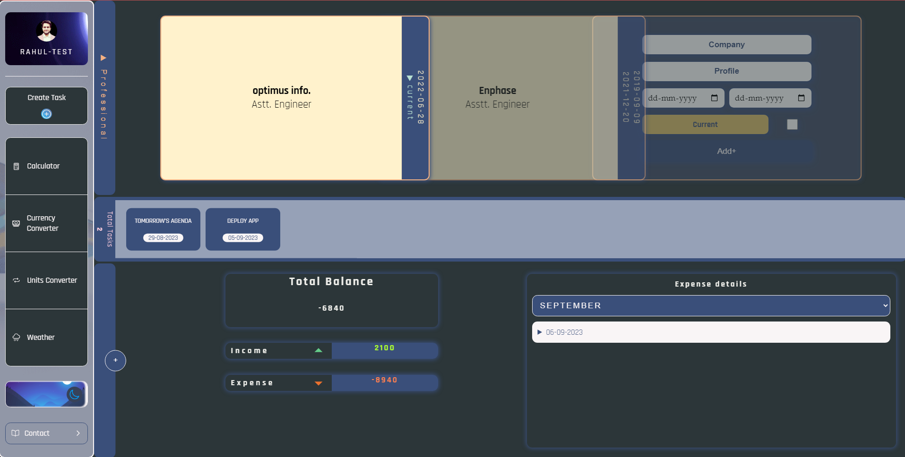
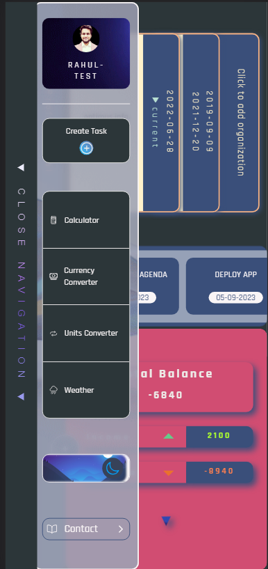

# React Utility Tracker App [https://utility-tracker.netlify.app/]

Welcome to the React Tracker App! This web application combines various tools and trackers to help you manage your daily tasks, finances, and stay updated with the latest weather information. Additionally, it includes user authentication using Firebase for secure access.

## Table of Contents

1. [Introduction](#introduction)
2. [Features](#features)
3. [Tools and Technologies](#tools-and-technologies)
4. [Usage](#usage)
5. [Screenshots](#screenshots)
6. [License](#license)

## Introduction

The React Tracker App is a multi-purpose application designed to simplify various aspects of your life. It offers the following key features:

## Features

### User Authentication

- Secure login and signup functionality using Firebase Authentication.
- Protects your data and ensures a personalized experience.

### Calculator

- Basic calculator for performing arithmetic operations.
- Helps you with quick calculations without leaving the app.

### Currency Converter

- Converts between different currencies using real-time exchange rates.
- Stay updated with the latest currency conversions for your international transactions.

### Unit Converter

- Converts various units such as length, weight, volume, and more.
- Simplify unit conversions for everyday tasks.

### Weather Tracker

- Provides real-time weather information based on your location.
- Stay informed about current weather conditions, temperature, and forecasts.

### Expense Tracker

- Helps you keep track of your daily expenses and budget.
- Categorize your expenses and view detailed reports.

### Career Tracker

- Organize your career goals, job applications, and interviews.
- Stay on top of your professional development.

### Task Creator

- Create, manage, and prioritize tasks and to-do lists.
- Stay organized and ensure you complete your daily tasks.

## Tools and Technologies

The React Tracker App is built using the following tools and technologies:

- React
- Firebase Authentication

## Usage

1. **User Authentication**: Sign up for an account or log in to an existing one to access the app's features.

2. **Calculator**: Use the calculator for quick arithmetic calculations.

3. **Currency Converter**: Convert currencies based on real-time exchange rates.

4. **Unit Converter**: Convert various units as needed.

5. **Weather Tracker**: Get current weather information by allowing location access.

6. **Expense Tracker**: Record and categorize your expenses to manage your finances.

7. **Career Tracker**: Organize your job applications and career goals.

8. **Task Creator**: Create and manage your to-do lists and tasks.

## Screenshots

## License

This project is only for Learning purpose.
